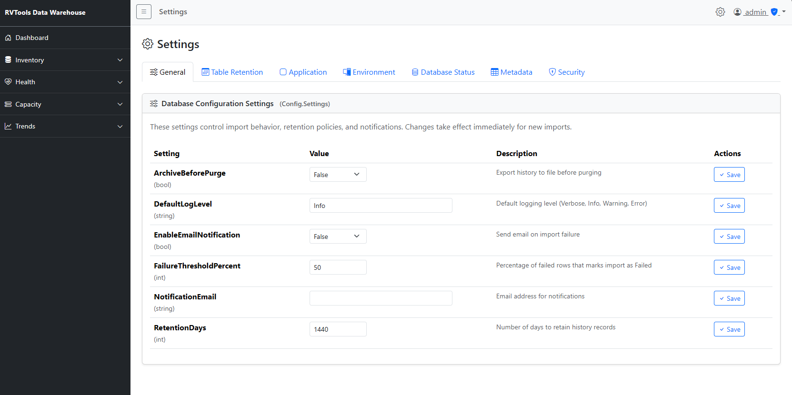
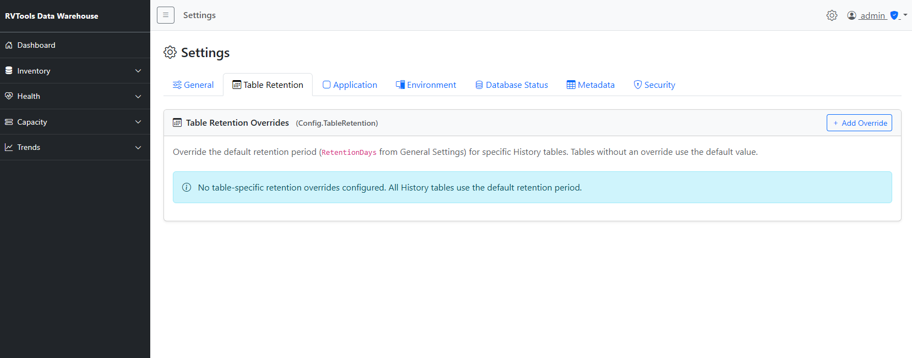
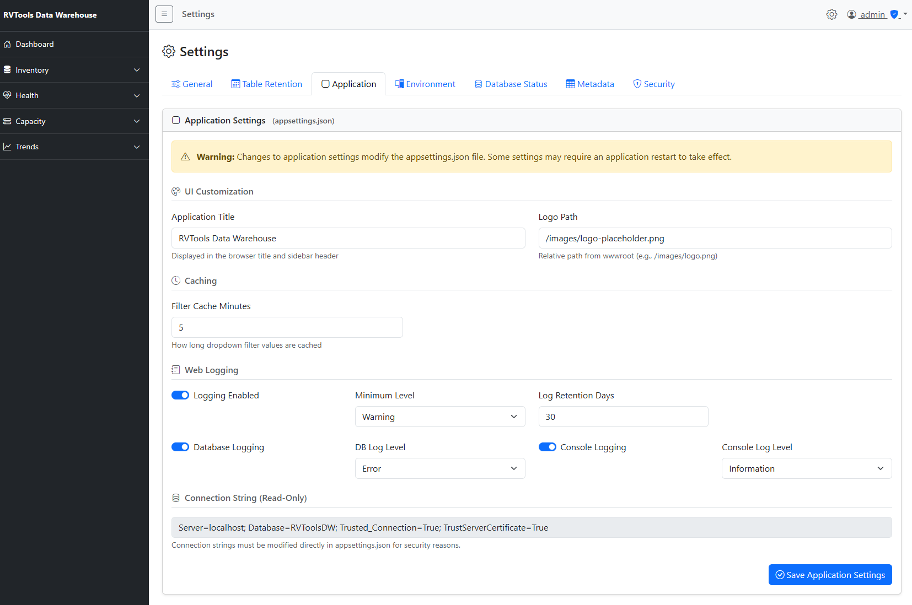
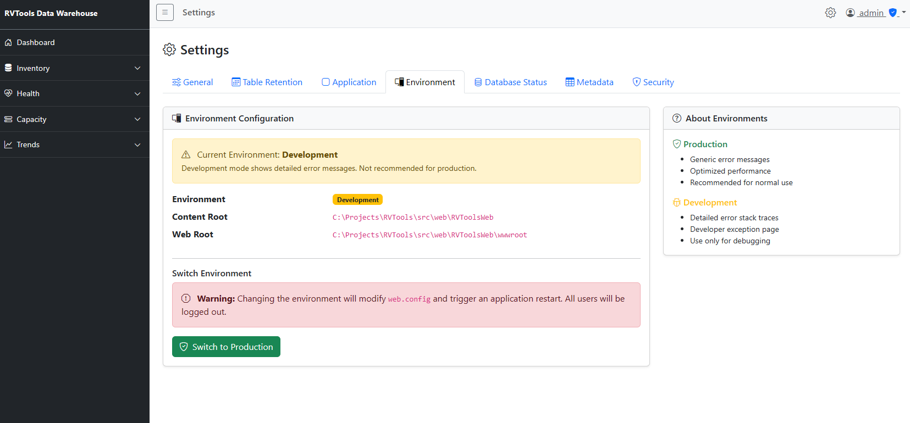
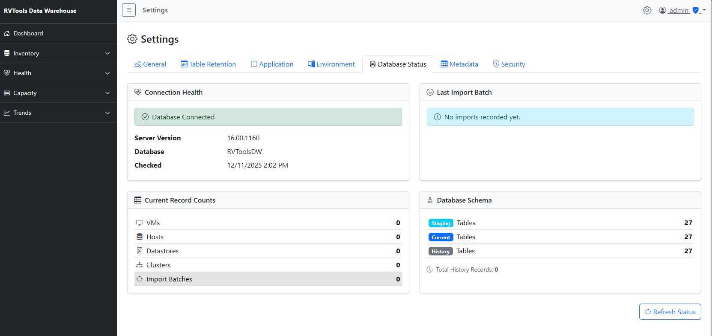
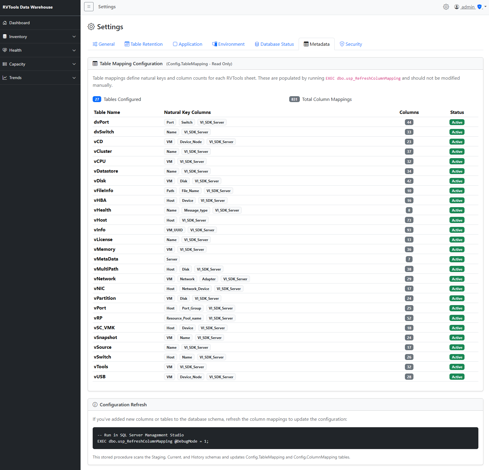

# Admin Settings Guide

**Navigation**: [Home](../README.md) | [Installation](installation.md) | [Authentication Setup](authentication-setup.md) | [LDAP Configuration](ldap-configuration.md)

---

## Overview

The Settings section provides administrative control over the RVTools Data Warehouse configuration, user management, and database monitoring.

**Access**: Admin role required
**URL**: `/Settings` or click gear icon in top-right corner



The Settings page has 7 tabs:
1. **General** - Database configuration settings
2. **Table Retention** - Per-table history retention overrides
3. **Application** - Application-level settings (UI, logging, caching)
4. **Environment** - View/switch ASP.NET environment (IIS only)
5. **Database Status** - Database health, statistics, and monitoring
6. **Metadata** - View table/column mappings (read-only)
7. **Security** - User management and authentication provider configuration

---

## General Settings Tab


Manage database configuration settings stored in `Config.Settings` table.

### Available Settings

| Setting | Type | Default | Description |
|---------|------|---------|-------------|
| **ArchiveBeforePurge** | bool | False | Export history to file before purging |
| **DefaultLogLevel** | string | Info | Default logging level (Verbose, Info, Warning, Error) |
| **EnableEmailNotification** | bool | False | Send email on import failure |
| **FailureThresholdPercent** | int | 50 | Percentage of failed rows that marks import as Failed |
| **NotificationEmail** | string | (empty) | Email address for notifications |
| **RetentionDays** | int | 1440 | Number of days to retain history records (4 years) |

### Making Changes

1. Click in the **Value** field to edit
2. For dropdowns (bool, enum), select from list
3. For text/numbers, type the new value
4. Click **Save** button for that row
5. Changes take effect immediately for new imports

**Note**: Changes are saved to `Config.Settings` table and persist across application restarts.

---

## Table Retention Tab



Override the default retention period for specific History tables.

### Purpose

By default, all History tables use the `RetentionDays` value from General Settings (1440 days = 4 years). Table Retention allows per-table overrides.

**Use cases**:
- Keep VM history longer than host history
- Reduce retention for large tables (vFileInfo)
- Increase retention for critical tables (vHealth)

### Adding a Retention Override

1. Click **+ Add Override** button
2. Select **Table Name** from dropdown (all 27 History tables)
3. Enter **Retention Days** (number of days to keep history)
4. Click **Save**

### Managing Overrides

- **Edit**: Click the value, change it, click Save
- **Delete**: Click the trash icon to remove override

**Information Alert**:
When no overrides exist, the page shows: "No table-specific retention overrides configured. All History tables use the default retention period."

### How Retention Works

The `usp_PurgeOldHistory` stored procedure:
1. Checks `Config.TableRetention` for table-specific overrides
2. Falls back to `Config.Settings.RetentionDays` if no override
3. Deletes records where `ValidFrom < DATEADD(day, -RetentionDays, GETUTCDATE())`
4. Only purges non-current records (`IsCurrent = 0`)

**Schedule retention cleanup**:
```sql
-- Manual execution
EXEC dbo.usp_PurgeOldHistory;

-- Dry run (see what would be deleted)
EXEC dbo.usp_PurgeOldHistory @DryRun = 1;
```

---

## Application Settings Tab



*Note: Screenshot may show "settigns-application.png" filename typo*

Manage application-level settings stored in `appsettings.json`.

### Available Settings

**Logging Configuration:**
- Minimum log levels per category
- File logging options
- Console output settings

**UI Configuration:**
- Application title
- Logo path
- Theme settings

**Cache Configuration:**
- Filter dropdown cache duration
- Memory cache size limits

**Note**: Changes to `appsettings.json` may require application restart depending on the setting.

---

## Environment Tab



View and switch the ASP.NET Core environment (Development/Production).

### Current Environment

Displays:
- **Current Environment**: Development, Staging, or Production
- **Is Development**: Boolean flag
- **Is Production**: Boolean flag
- **Content Root Path**: Physical application path
- **Web Root Path**: wwwroot folder path

### Switching Environments (IIS Only)

**For IIS deployments:**

1. Click **Switch to Production** (or Development) button
2. Confirm the environment switch
3. Application restarts automatically
4. `web.config` is updated with new environment variable

**Effect**:
- Production: Disables detailed error pages, enables optimizations
- Development: Shows detailed errors, developer exception page

**Note**: This feature only works when hosted in IIS. For `dotnet run` or Kestrel, set the `ASPNETCORE_ENVIRONMENT` environment variable manually.

---

## Database Status Tab



Monitor database health, table statistics, and import history.

### Connection Health

**Indicator**: Green checkmark = "Database Connected"

Displays:
- **Server Version**: SQL Server version (e.g., 16.00.1160)
- **Database**: Database name (RVToolsDW)
- **Checked**: Timestamp of last health check

Click **Refresh Status** button to update.

### Last Import Batch

Shows details of the most recent import:
- **Import Date**: When import was executed
- **File Name**: Source RVTools Excel file
- **Status**: Success, Failed, or Processing
- **Rows Staged**: Total rows imported to Staging
- **Duration**: Import execution time

If no imports exist: "No imports recorded yet."

### Current Record Counts

Real-time count of records in Current tables:
- **VMs**: Count from Current.vInfo
- **Hosts**: Count from Current.vHost
- **Datastores**: Count from Current.vDatastore
- **Clusters**: Count from Current.vCluster
- **Import Batches**: Count from Audit.ImportBatch

### Database Schema

Shows table counts per schema:
- **Staging**: 27 tables (should match)
- **Current**: 27 tables (should match)
- **History**: 27 tables (should match)
- **Total History Records**: Sum of all History table rows

**Purpose**: Verify database structure is complete and monitor growth.

---

## Metadata Tab



View table and column mapping metadata (read-only).

### Table Mapping Configuration

Displays `Config.TableMapping` with:
- **Table Name**: RVTools table name (e.g., vInfo, vHost)
- **Natural Key Columns**: Columns used for MERGE operations
- **Is Active**: Whether table is actively processed
- **Actions**: View details button

**Natural Keys**: Used by `usp_MergeTable` to identify matching records across imports. Most tables use `[ColumnName] + VI_SDK_Server` to support multi-vCenter environments.

### Configuration Metadata

Shows configuration table statistics:
- **Total Table Mappings**: Count of tables in Config.TableMapping (should be 27)
- **Total Column Mappings**: Count of columns in Config.ColumnMapping (should be ~850)
- **Last Metadata Refresh**: When `usp_RefreshColumnMapping` was last executed

### When to Refresh Metadata

**Run after**:
- Adding new columns to Staging/Current/History tables
- Changing column data types
- Adding new RVTools tabs

```sql
-- Refresh column mapping metadata
EXEC dbo.usp_RefreshColumnMapping @DebugMode = 1;
```

The Metadata tab allows you to verify the mapping was refreshed correctly.

---

## Security Tab


Manage users and configure authentication providers.

### Authentication Provider

**Active Provider**: Shows current provider (Local Database or Active Directory)

**Status**:
- Green "Configured" badge = Authentication is configured
- Setup complete

**Actions**:
- Click **Configure** to modify authentication provider settings
- Switch between LocalDB and LDAP/AD
- Update LDAP connection details

See [LDAP Configuration Guide](ldap-configuration.md) for detailed LDAP setup.

### User Management

**Table Columns**:
- **Username**: Login username
- **Email**: Optional email address
- **Role**: Admin or User
- **Status**: Active (green) or Inactive (red)
- **Last Login**: Timestamp of most recent successful login
- **Actions**: Edit (pencil icon) or Delete (trash icon)

#### Adding a User

1. Click **+ Add User** button
2. Fill in user details:
   - **Username**: Login username (required)
   - **Email**: Optional email address
   - **Password**: Initial password (required)
   - **Role**: Admin or User
   - **Force Password Change**: Check to require password change on first login
3. Click **Save**

**Best Practice**: Always check "Force password change" for new users so they set their own secure password.

#### Editing a User

1. Click the **pencil icon** in Actions column
2. Modify:
   - Email address
   - Role (Admin ↔ User)
   - Active status (enable/disable account)
3. Click **Save**

**Note**: You cannot change the username. To change username, delete the user and create a new one.

#### Resetting a Password

1. Click the **key icon** in Actions column
2. Enter new password
3. Check "Force password change on next login" (recommended)
4. Click **Reset Password**

The user will be logged out (if currently active) and required to change password on next login.

#### Deleting a User

1. Click the **trash icon** in Actions column
2. Confirm deletion

**Restrictions**:
- Cannot delete the `admin` user
- Cannot delete yourself (the currently logged-in user)
- Deleted users cannot be recovered (permanent)

---

## Admin-Only Access

All Settings tabs require the Admin role:

```csharp
[Authorize(Roles = "Admin")]
public class SettingsController : Controller
```

**User role** accounts cannot access Settings - they are redirected to Access Denied page.

---

## Best Practices

### General Settings

- **RetentionDays**: Set based on audit requirements and disk space
  - Default 1440 days (4 years) is suitable for most compliance needs
  - Shorter retention for non-production environments
- **FailureThresholdPercent**: 50% is a good balance
  - Too low: Marks imports as failed for minor data issues
  - Too high: Doesn't flag problematic imports

### Table Retention

- **Override sparingly**: Most tables should use the default
- **Consider size**: Large tables like vFileInfo may need shorter retention
- **Regulatory compliance**: Ensure retention meets audit requirements

### User Management

- **Limit Admin role**: Only assign to users who need Settings access
- **Force password changes**: Always check this for new users
- **Deactivate instead of delete**: Preserve audit trail by deactivating users
- **Regular review**: Periodically review active users and remove unused accounts

### Authentication Provider

- **Use LDAP for enterprise**: Centralized management and better security
- **Enable fallback**: Keep fallback enabled to prevent lockout if LDAP fails
- **Test before switching**: Verify LDAP settings work before changing providers

---

## Troubleshooting

### Cannot Access Settings

**Error**: Redirected to Access Denied page

**Solution**: Settings requires Admin role. Log in with an Admin account.

```sql
-- Check your role
SELECT Username, Role FROM Web.Users WHERE Username = 'yourusername';

-- Grant Admin role (run as existing admin)
UPDATE Web.Users SET Role = 'Admin' WHERE Username = 'yourusername';
```

### Changes Not Taking Effect

**For Config.Settings**:
- Changes are immediate for new imports
- Existing in-progress operations use old settings

**For appsettings.json**:
- Some settings require application restart
- Restart IIS application pool or web app

### Database Status Shows Old Data

Click the **Refresh Status** button to reload current statistics.

### Metadata Refresh Needed

If you added columns or tables:

```sql
-- Refresh metadata
EXEC dbo.usp_RefreshColumnMapping @DebugMode = 1;
```

Then refresh the Metadata tab to verify.

---

## Related Documentation

- [Authentication Setup](authentication-setup.md) - First-time setup and login
- [LDAP Configuration](ldap-configuration.md) - Configuring Active Directory
- [Security Hardening](security-hardening.md) - Security best practices
- [Troubleshooting](reference/troubleshooting.md) - General troubleshooting

---

## Appendix: Settings Database Tables

### Config.Settings

Global configuration settings:

```sql
-- View all settings
SELECT * FROM Config.Settings;

-- Update a setting
UPDATE Config.Settings SET SettingValue = '90' WHERE SettingKey = 'DefaultLogLevel';
```

### Config.TableRetention

Per-table retention overrides:

```sql
-- View retention overrides
SELECT * FROM Config.TableRetention ORDER BY TableName;

-- Add override for vInfo table (keep 2 years)
INSERT INTO Config.TableRetention (TableName, RetentionDays)
VALUES ('vInfo', 730);
```

### Config.TableMapping

Table-level metadata (natural keys, active status):

```sql
-- View table mappings
SELECT * FROM Config.TableMapping ORDER BY TableName;
```

### Config.ColumnMapping

Column-level metadata (data types, natural keys):

```sql
-- View column mappings for vInfo
SELECT * FROM Config.ColumnMapping WHERE TableName = 'vInfo' ORDER BY OrdinalPosition;

-- Refresh after schema changes
EXEC dbo.usp_RefreshColumnMapping @DebugMode = 1;
```
