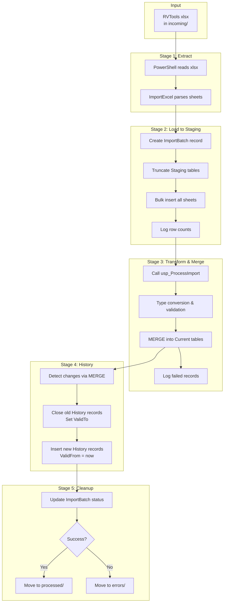
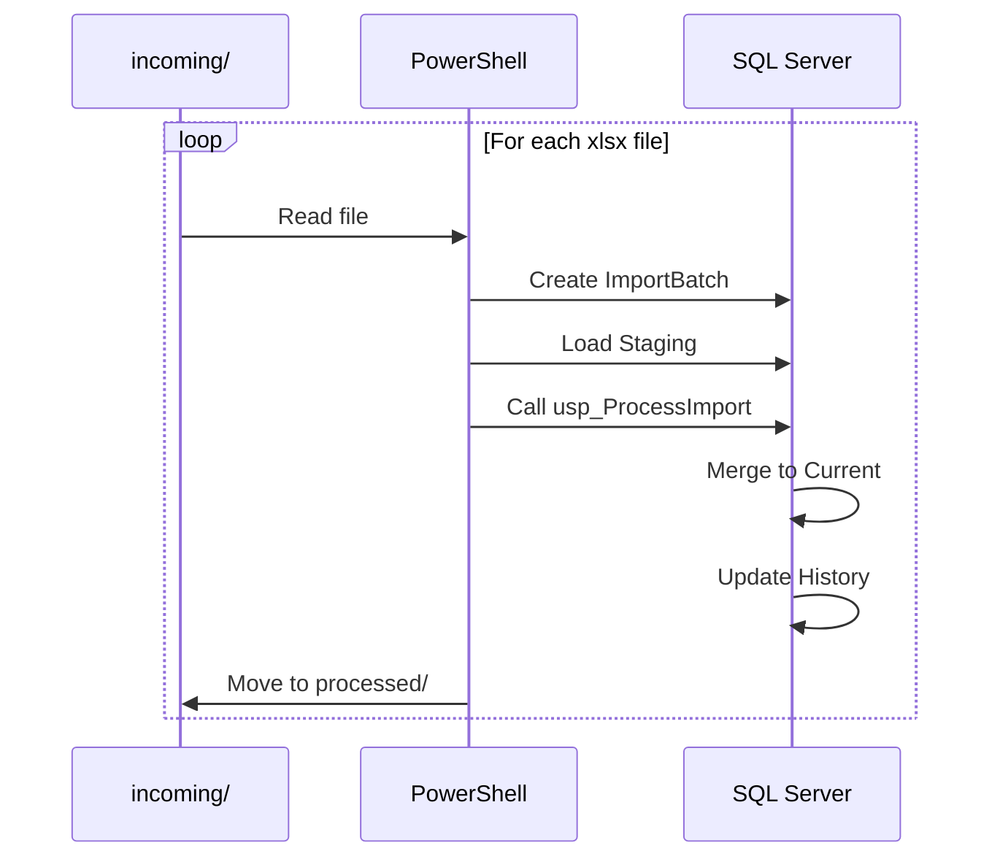

# Data Flow

> ETL process and data movement through the system.

**Navigation**: [Home](../../README.md) | [Overview](./overview.md) | [Database Schema](./database-schema.md)

---

## ETL Process Flow



## Stage 1: Extract

PowerShell reads the xlsx file using ImportExcel:

```powershell
# Get all sheet names
$sheets = Get-ExcelSheetInfo -Path $file

# Read each sheet
foreach ($sheet in $sheets) {
    $data = Import-Excel -Path $file -WorksheetName $sheet.Name
    # Process...
}
```

**Sheets processed:** All 27 RVTools tabs (vInfo, vCPU, vMemory, etc.)

## Stage 2: Load to Staging

Data loaded into Staging schema without type conversion:

```sql
-- Truncate staging table
TRUNCATE TABLE Staging.vInfo;

-- Bulk insert (via SqlBulkCopy)
-- All columns as NVARCHAR(MAX)
```

**Key points:**
- No type constraints prevent failures
- ImportBatchId links all records
- Row counts logged to Audit tables

## Stage 3: Transform & Merge

The `usp_ProcessImport` stored procedure:

1. **Type Conversion** - Convert strings to proper types
2. **Validation** - Check required fields, valid ranges
3. **MERGE** - Update existing or insert new records

```sql
MERGE Current.vInfo AS target
USING (
    SELECT
        VM,
        Powerstate,
        TRY_CAST(CPUs AS INT) AS CPUs,
        TRY_CAST(Memory AS INT) AS Memory,
        -- ... type conversions
    FROM Staging.vInfo
    WHERE ImportBatchId = @BatchId
) AS source
ON target.VM = source.VM
   AND target.VISDKServer = source.VISDKServer
WHEN MATCHED AND (
    target.Powerstate <> source.Powerstate
    OR target.CPUs <> source.CPUs
    -- ... change detection
) THEN UPDATE SET ...
WHEN NOT MATCHED THEN INSERT ...;
```

**Failed records:** Captured in `Audit.FailedRecords` with error details

## Stage 4: History Tracking

SCD Type 2 implementation:

```sql
-- 1. Close old records (set ValidTo)
UPDATE History.vInfo
SET ValidTo = @ImportTime
WHERE RowId IN (SELECT RowId FROM @ChangedRows)
  AND ValidTo IS NULL;

-- 2. Insert new versions
INSERT INTO History.vInfo (RowId, VM, Powerstate, ..., ValidFrom, ValidTo)
SELECT RowId, VM, Powerstate, ..., @ImportTime, NULL
FROM Current.vInfo
WHERE RowId IN (SELECT RowId FROM @ChangedRows);
```

**Change detection:** Based on MERGE output clause

## Stage 5: Cleanup

After processing:

```
Success:
  incoming/export.xlsx → processed/export_20241208_143022.xlsx

Failure:
  incoming/export.xlsx → errors/export_20241208_143022.xlsx
```

**ImportBatch updated:**
- Status = Success | Failed | Partial
- EndTime = completion timestamp
- Row counts finalized

## Batch Processing

Multiple files processed sequentially:



## Error Handling

| Error Type | Handling |
|------------|----------|
| File read error | Move to errors/, log exception |
| Sheet missing | Skip sheet, log warning |
| Type conversion | Log to FailedRecords, continue |
| MERGE conflict | Log error, rollback sheet |
| Database error | Rollback batch, move to errors/ |

---

## Next Steps

- [Importing Data](../usage/importing-data.md) - Run imports
- [Troubleshooting](../reference/troubleshooting.md) - Common issues

## Need Help?

See [Troubleshooting](../reference/troubleshooting.md) or [open an issue](https://github.com/bankielewicz/RVToolsDW/issues).
