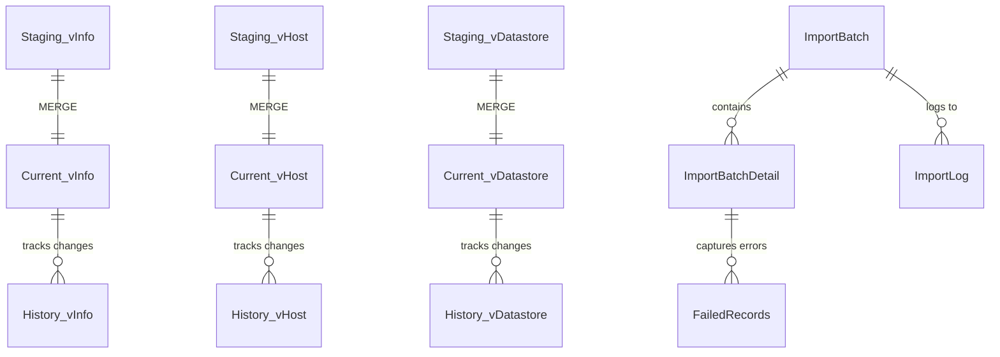

# Database Schema

> Database structure and schema documentation.

**Navigation**: [Home](../../README.md) | [Overview](./overview.md) | [Data Flow](./data-flow.md)

---

## Schema Diagram



## Schemas

| Schema | Purpose | Tables |
|--------|---------|--------|
| Staging | Raw import data (all NVARCHAR(MAX)) | 27 |
| Current | Latest typed snapshot | 27 |
| History | SCD Type 2 historical data | 27 |
| Audit | Import tracking and logging | 6 |
| Config | Settings, configuration, and column mapping | 4 |
| Reporting | Views for reports | 13 |

## Staging Schema

All 27 RVTools tabs with all columns as NVARCHAR(MAX):

```sql
CREATE TABLE Staging.vInfo (
    ImportBatchId INT,
    VM NVARCHAR(MAX),
    Powerstate NVARCHAR(MAX),
    Template NVARCHAR(MAX),
    -- ... 95 more columns
);
```

**Key characteristics:**
- No type constraints (prevents import failures)
- No primary keys (allows duplicates during staging)
- Truncated and reloaded each import

## Current Schema

Typed columns representing current state:

```sql
CREATE TABLE Current.vInfo (
    RowId INT IDENTITY PRIMARY KEY,
    ImportBatchId INT NOT NULL,
    VM NVARCHAR(255) NOT NULL,
    Powerstate NVARCHAR(50),
    Template BIT,
    CPUs INT,
    Memory INT,
    -- ... typed columns
    CreatedDate DATETIME2 DEFAULT GETDATE(),
    ModifiedDate DATETIME2 DEFAULT GETDATE()
);
```

**Key characteristics:**
- Proper data types for each column
- Primary key and indexes
- Created/Modified timestamps

## History Schema

SCD Type 2 tracking:

```sql
CREATE TABLE History.vInfo (
    HistoryId BIGINT IDENTITY PRIMARY KEY,
    RowId INT NOT NULL,
    ImportBatchId INT NOT NULL,
    VM NVARCHAR(255) NOT NULL,
    -- ... all current columns
    ValidFrom DATETIME2 NOT NULL,
    ValidTo DATETIME2 NULL,
    IsCurrent AS CAST(CASE WHEN ValidTo IS NULL THEN 1 ELSE 0 END AS BIT)
);
```

**Key characteristics:**
- All columns from Current plus tracking columns
- `ValidFrom` = when this version became active
- `ValidTo` = when superseded (NULL = current)
- `IsCurrent` = computed column for convenience

## Audit Schema

### ImportBatch

Tracks each import execution:

| Column | Type | Description |
|--------|------|-------------|
| BatchId | INT | Primary key |
| FileName | NVARCHAR(500) | Source file path |
| StartTime | DATETIME2 | Import start time |
| EndTime | DATETIME2 | Import end time |
| Status | NVARCHAR(50) | Success, Failed, Partial |
| TotalRows | INT | Total rows processed |
| SuccessRows | INT | Rows successfully imported |
| FailedRows | INT | Rows that failed |

### ImportBatchDetail

Per-sheet statistics:

| Column | Type | Description |
|--------|------|-------------|
| DetailId | INT | Primary key |
| BatchId | INT | Foreign key to ImportBatch |
| SheetName | NVARCHAR(100) | RVTools tab name |
| RowCount | INT | Rows in sheet |
| ImportedCount | INT | Rows imported |
| ErrorCount | INT | Rows with errors |

### FailedRecords

Captures individual failed rows:

| Column | Type | Description |
|--------|------|-------------|
| FailedRecordId | BIGINT | Primary key |
| BatchId | INT | Foreign key |
| SheetName | NVARCHAR(100) | Source sheet |
| RowNumber | INT | Row in source |
| ErrorMessage | NVARCHAR(MAX) | Error details |
| RawData | NVARCHAR(MAX) | Original row data (JSON) |

### ImportLog

Timestamped log entries:

| Column | Type | Description |
|--------|------|-------------|
| LogId | BIGINT | Primary key |
| BatchId | INT | Foreign key |
| LogTime | DATETIME2 | Timestamp |
| LogLevel | NVARCHAR(20) | Verbose, Info, Warning, Error |
| Message | NVARCHAR(MAX) | Log message |

### ErrorLog

Detailed error capture for debugging merge issues:

| Column | Type | Description |
|--------|------|-------------|
| ErrorLogId | BIGINT | Primary key (identity) |
| LogTime | DATETIME2 | When error occurred |
| ImportBatchId | INT | Associated batch |
| ProcedureName | NVARCHAR(200) | Which procedure failed |
| TableName | NVARCHAR(100) | Which table was processing |
| Operation | NVARCHAR(50) | MERGE, HISTORY_CLOSE, HISTORY_INSERT |
| ErrorNumber | INT | SQL error number |
| ErrorSeverity | INT | SQL error severity |
| ErrorState | INT | SQL error state |
| ErrorLine | INT | Line number in dynamic SQL |
| ErrorMessage | NVARCHAR(MAX) | Full error text |
| DynamicSQL | NVARCHAR(MAX) | SQL that was executed |
| ContextData | NVARCHAR(MAX) | JSON with additional context |

### MergeProgress

Real-time merge operation tracking:

| Column | Type | Description |
|--------|------|-------------|
| ProgressId | BIGINT | Primary key (identity) |
| ImportBatchId | INT | Associated batch |
| TableName | NVARCHAR(100) | Table being processed |
| Operation | NVARCHAR(50) | MERGE, HISTORY_CLOSE, etc. |
| StartTime | DATETIME2 | When operation started |
| EndTime | DATETIME2 | When operation completed |
| Status | NVARCHAR(20) | InProgress, Success, Failed, Skipped |
| RowsInStaging | INT | Source row count |
| RowsProcessed | INT | Rows merged |
| RowsInserted | INT | New rows |
| RowsUpdated | INT | Changed rows |
| RowsDeleted | INT | Removed rows |
| ErrorMessage | NVARCHAR(MAX) | Error if failed |
| DurationMs | INT | Elapsed milliseconds |

## Config Schema

### Settings

Application settings:

| Column | Type | Description |
|--------|------|-------------|
| SettingId | INT | Primary key |
| SettingName | NVARCHAR(100) | Setting identifier |
| SettingValue | NVARCHAR(MAX) | Setting value |
| Description | NVARCHAR(500) | Setting description |

### TableRetention

Per-table retention settings:

| Column | Type | Description |
|--------|------|-------------|
| TableName | NVARCHAR(100) | Primary key |
| RetentionDays | INT | Days to retain history |

### TableMapping

Natural key definitions for dynamic MERGE:

| Column | Type | Description |
|--------|------|-------------|
| TableName | NVARCHAR(100) | Primary key |
| NaturalKeyColumns | NVARCHAR(500) | Comma-separated key columns |
| HistoryTrackingColumns | NVARCHAR(MAX) | Columns that trigger history (NULL = all) |
| IsActive | BIT | Enable/disable table processing |
| CreatedDate | DATETIME2 | Record creation time |
| ModifiedDate | DATETIME2 | Last modification time |

### ColumnMapping

Column-level metadata for dynamic MERGE (~830 rows):

| Column | Type | Description |
|--------|------|-------------|
| MappingId | INT | Primary key (identity) |
| TableName | NVARCHAR(100) | FK to TableMapping |
| StagingColumnName | NVARCHAR(200) | Column name in Staging schema |
| CurrentColumnName | NVARCHAR(200) | Column name in Current schema |
| TargetDataType | NVARCHAR(100) | SQL data type for TRY_CAST |
| MaxLength | INT | For NVARCHAR columns |
| IsBooleanField | BIT | Needs True/1/Yes → 1 conversion |
| IsNaturalKey | BIT | Part of MERGE ON clause |
| IsRequired | BIT | Must have non-NULL value |
| IsIdentity | BIT | Skip in INSERT (auto-generated) |
| IsSystemColumn | BIT | ImportBatchId, dates, etc. |
| IncludeInMerge | BIT | Include in dynamic MERGE SQL |
| OrdinalPosition | INT | Column order |

**Usage:** Auto-populated by `usp_RefreshColumnMapping`. Run after schema changes.

## Reporting Schema

Views organized by category:

### Inventory Views
- `vw_VM_Inventory` - Complete VM listing
- `vw_Host_Inventory` - ESXi host details
- `vw_Cluster_Summary` - Cluster overview
- `vw_Datastore_Inventory` - Storage summary

### Health Views
- `vw_Health_Issues` - Active problems
- `vw_Snapshot_Aging` - Old snapshots
- `vw_Tools_Status` - VMware Tools status

### Capacity Views
- `vw_Host_Capacity` - Host utilization
- `vw_Datastore_Capacity` - Storage capacity
- `vw_VM_Resource_Allocation` - VM sizing

### Trend Views
- `vw_VM_Count_Trend` - VM growth over time
- `vw_Datastore_Capacity_Trend` - Storage growth
- `vw_VM_Config_Changes` - Configuration drift

---

## Next Steps

- [Data Flow](./data-flow.md) - ETL process details
- [Querying Data](../usage/querying-data.md) - Query examples

## Need Help?

See [Troubleshooting](../reference/troubleshooting.md) or [open an issue](https://github.com/bankielewicz/RVToolsDW/issues).
