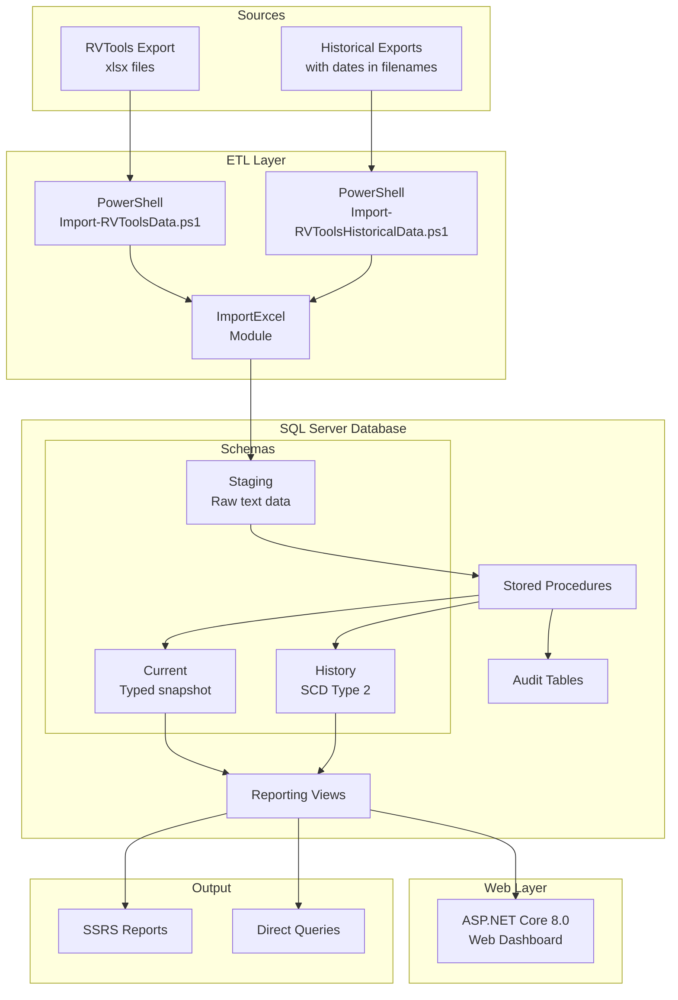

# Architecture Overview

> High-level system architecture and design decisions.

**Navigation**: [Home](../../README.md) | [Database Schema](./database-schema.md) | [Data Flow](./data-flow.md)

---

## System Components

## Technology Stack

| Layer | Technology | Purpose |
|-------|------------|---------|
| Data Source | RVTools 4.x | VMware inventory export |
| ETL | PowerShell 5.1+ | Orchestration and file handling |
| Excel Parsing | ImportExcel module | Read xlsx without Excel installed |
| Database | SQL Server 2016+ | Data storage and processing |
| Web | ASP.NET Core 8.0 | Interactive browser-based dashboard |
| Reporting | SQL Views + SSRS | Pre-built analytical queries and reports |

## Design Decisions

### Three-Schema Pattern

The system uses three schemas to separate concerns:

1. **Staging** - All columns as NVARCHAR(MAX) to prevent import failures from type mismatches
2. **Current** - Typed columns representing the most recent state of each entity
3. **History** - SCD Type 2 tracking with ValidFrom/ValidTo timestamps

This pattern allows:
- Import of any RVTools version without schema changes
- Type validation after import (not during)
- Complete historical tracking of all changes

### NVARCHAR(MAX) Staging

Staging tables use NVARCHAR(MAX) for all columns because:
- RVTools column types can vary between versions
- Prevents import failures from unexpected data
- Type conversion happens in stored procedures where errors can be logged

### SCD Type 2 History

History tables track changes using:
- `ValidFrom` - When this version became current
- `ValidTo` - When this version was superseded (NULL = current)
- `IsCurrent` - Computed flag for query convenience

This enables:
- Point-in-time queries ("What was the VM config on date X?")
- Change tracking ("When did this VM's memory change?")
- Trend analysis ("How has storage grown over time?")

### Natural Keys

Each RVTools tab has natural keys used for MERGE operations:
- vInfo: VM + VI SDK Server
- vHost: Host + VI SDK Server
- vDatastore: Name + VI SDK Server

This ensures proper handling of:
- Multi-vCenter environments
- Entities with the same name across different sources

### Historical Import Support

For bulk importing historical data with dates embedded in filenames:

- `Import-RVToolsHistoricalData.ps1` parses dates from filename pattern `{vcenter-name}_{d_mm_yyyy}.{domain.tld}.xlsx`
  - `{vcenter-name}`: Alphanumeric + hyphens (e.g., `vCenter01`, `prod-vcenter`)
  - `{domain.tld}`: Must contain at least one dot (e.g., `domain.com`)
- `RVToolsExportDate` stored in `Audit.ImportBatch`
- Parsed date used as `ValidFrom` in History tables (not import timestamp)
- Files processed in chronological order (oldest first) to maintain timeline integrity

See [Data Flow](./data-flow.md#historical-import-flow) for details.

---

## Next Steps

- [Database Schema](./database-schema.md) - Schema details
- [Data Flow](./data-flow.md) - ETL process walkthrough

## Need Help?

See [Troubleshooting](../reference/troubleshooting.md) or [open an issue](https://github.com/bankielewicz/RVToolsDW/issues).
