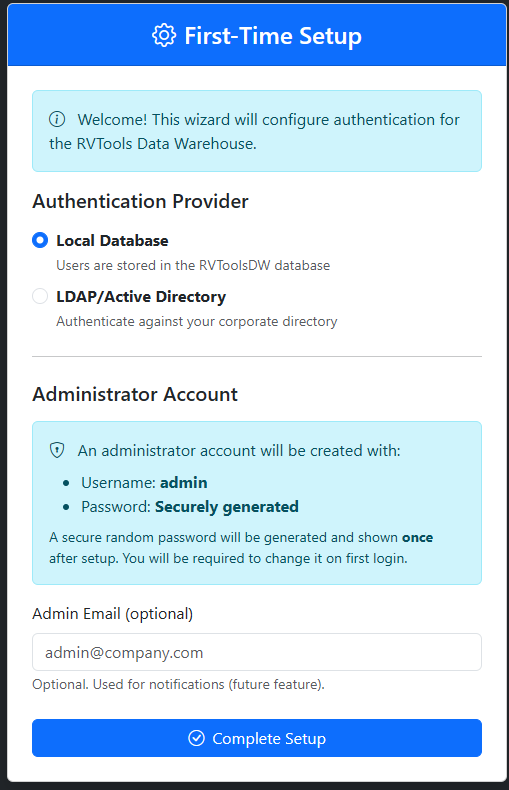
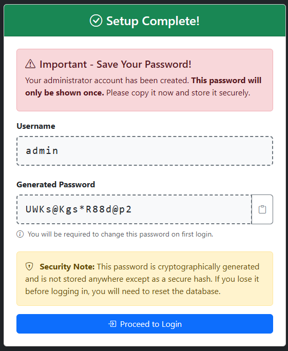
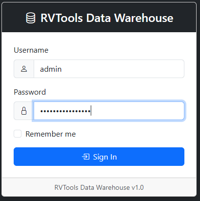
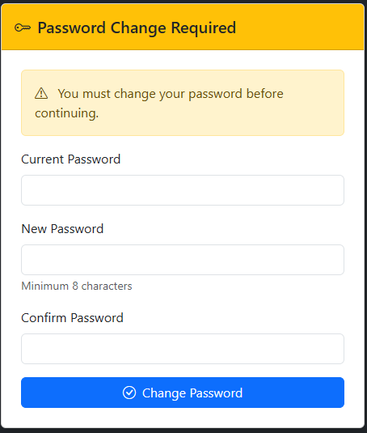
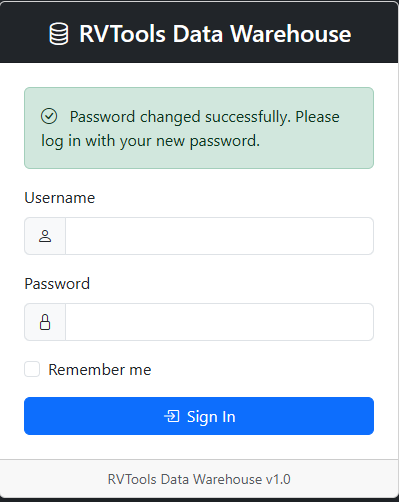

# Authentication Setup Guide

**Navigation**: [Home](../README.md) | [Installation](installation.md) | [LDAP Configuration](ldap-configuration.md) | [Admin Settings](admin-settings-guide.md)

---

## Overview

The RVTools Data Warehouse web application uses cookie-based authentication to protect access to VMware inventory data and administrative functions.

### Authentication Providers

| Provider | Description | Use Case |
|----------|-------------|----------|
| **Local Database** | Users stored in RVToolsDW database | Standalone deployments, small teams |
| **LDAP/Active Directory** | Authenticate against corporate directory | Enterprise deployments, centralized user management |

### Roles and Access Control

| Role | Access Level | Permissions |
|------|--------------|-------------|
| **Admin** | Full access | View all reports, access Settings, manage users, configure LDAP |
| **User** | Read-only | View all reports only |

### Session Details

- **Cookie-based** authentication (not ASP.NET Core Identity)
- **Session duration**: 8 hours with sliding expiration
- **Cookie name**: `RVToolsDW.Auth`
- **Security**: HttpOnly, SameSite=Strict, SecurePolicy

---

## First-Time Setup

### Accessing the Setup Wizard

On first deployment, the application will automatically redirect to the setup wizard:



### Setup Steps

1. **Navigate to the application** (e.g., `https://localhost:5001` or your IIS URL)
2. You will be automatically redirected to `/Account/Setup`
3. **Choose Authentication Provider:**
   - **Local Database**: For standalone deployments
   - **LDAP/Active Directory**: For enterprise AD integration
4. **Enter Admin Email** (optional - used for future notifications)
5. Click **Complete Setup**

### After Setup: Local Database

If you selected **Local Database**, you'll see the Setup Complete page with your generated admin credentials:



**IMPORTANT**:
- **Username**: `admin`
- **Password**: Cryptographically generated 16-character password shown ONCE
- **Copy the password immediately** - it will not be shown again
- You will be required to change this password on first login

---

## Logging In

### Login Page



1. Navigate to `/Account/Login` (or click "Proceed to Login" from setup)
2. Enter username: `admin`
3. Enter the generated password from Setup Complete page
4. Optionally check "Remember me" for persistent cookie
5. Click **Sign In**

### First Login: Forced Password Change

On first login with the generated password, you'll be required to change it:



**Requirements:**
- Enter your current password (the generated one)
- New password must be at least 8 characters
- New password must be different from current password
- Confirm new password

After changing password, you'll be redirected to login:



Log in with your new password to access the dashboard.

---

## Local Database Authentication

### Password Security

**Hashing Algorithm**: PBKDF2-SHA256
- **Iterations**: 100,000 (OWASP recommendation)
- **Salt**: 32-byte random salt per user
- **Storage**: Password hash and salt stored in `Web.Users` table

### Account Lockout

**Threshold**: 5 failed login attempts
**Lockout Duration**: 15 minutes
**Automatic Unlock**: After lockout period expires

### User Management

Administrators can manage users in **Settings > Security** tab:
- Create new users
- Edit user details (email, role)
- Reset user passwords
- Deactivate/activate users
- Delete users (except the admin account)

See [Admin Settings Guide](admin-settings-guide.md#security-tab) for details.

---

## LDAP/Active Directory Authentication

### Overview

When LDAP is configured, users authenticate against your corporate Active Directory or LDAP server.

**Features:**
- **Group-based role assignment** - AD groups map to Admin/User roles
- **Fallback to LocalDB** - Optional fallback if LDAP unavailable
- **Cross-platform** - Uses `System.DirectoryServices.Protocols` (works on Linux/Windows)
- **SSL/TLS Support** - Secure LDAP connections with certificate validation

### After Setup: LDAP

If you selected **LDAP/Active Directory** during setup, you'll see:


**Next Steps:**
1. Log in with your AD admin account
2. Navigate to **Settings > Security**
3. Click **Configure** next to Authentication Provider
4. Complete LDAP configuration (server, port, groups, etc.)

### LDAP Configuration

For detailed LDAP configuration instructions, see [LDAP Configuration Guide](ldap-configuration.md).

**Quick Reference:**
- **LDAP Server**: Hostname or IP (e.g., `ldap.company.com` or `192.168.1.10`)
- **Port**: 389 (standard) or 636 (SSL)
- **Domain**: AD domain (e.g., `company.com`)
- **Base DN**: Search base (e.g., `DC=company,DC=com`)
- **Service Account**: Bind DN + password for group queries
- **Admin Group**: AD group for Admin role
- **User Group**: AD group for User role
- **SSL**: Enable for production (validates certificates by default)

---

## Password Management

### Changing Your Password

1. Click your username in the top-right corner
2. Select **Change Password** from dropdown
3. Enter current password
4. Enter new password (minimum 8 characters)
5. Confirm new password
6. Click **Change Password**

### Admin Password Reset

Administrators can reset user passwords:

1. Go to **Settings > Security** tab
2. Find the user in the User Management table
3. Click the **Reset** icon (key icon)
4. Enter new password
5. Check "Force password change on next login" (recommended)
6. Click **Reset Password**

The user will be required to change their password on next login.

---

## Logout

To log out:

1. Click your username in the top-right corner
2. Click **Logout** from dropdown
3. You'll be redirected to the login page

Session cookies are cleared on logout.

---

## Troubleshooting

### Cannot Access Setup Wizard

**Problem**: Browser shows "Setup has already been completed. Access denied."

**Solution**: Setup can only be accessed before initial configuration. If you need to reconfigure:

```sql
-- Reset to unconfigured state (WARNING: This will require re-setup)
UPDATE Web.AuthSettings SET IsConfigured = 0;
DELETE FROM Web.Users;  -- Optional: Clear all users
```

Then restart the web application to clear middleware cache.

### Forgot Admin Password

**For LocalDB**:

If you lose the admin password before creating additional users, you must reset the database:

```sql
-- Delete the admin user
DELETE FROM Web.Users WHERE Username = 'admin';

-- Reset to setup wizard
UPDATE Web.AuthSettings SET IsConfigured = 0;
```

Restart the application and run through setup again.

**For LDAP**:

Use your AD admin account to log in and manage users via Settings > Security.

### Account Locked After Failed Attempts

Accounts are locked for 15 minutes after 5 failed login attempts.

**To manually unlock**:

```sql
-- Unlock user immediately
UPDATE Web.Users
SET FailedLoginAttempts = 0, LockoutEnd = NULL
WHERE Username = 'username';
```

### Authentication Provider Not Working

**Check database configuration**:

```sql
-- View current auth provider
SELECT AuthProvider, IsConfigured, LdapServer FROM Web.AuthSettings;
```

**For LDAP issues**, see [LDAP Configuration Guide](ldap-configuration.md#troubleshooting).

---

## Security Best Practices

1. **Change default password immediately** - The generated admin password should be changed on first login
2. **Use strong passwords** - Minimum 8 characters (longer recommended)
3. **Enable LDAP SSL/TLS** - Always use port 636 and validate certificates in production
4. **Limit Admin role** - Only assign Admin role to users who need Settings access
5. **Review user access regularly** - Check Settings > Security for active users
6. **Enable account lockout** - Default 5 attempts / 15 minutes (configurable)
7. **Use LDAP in production** - Centralized user management and password policies

---

## Database Tables

### Web.Users

Stores local user accounts (for LocalDB or LDAP user tracking).

**Key Columns:**
- `UserId` - Primary key
- `Username` - Login username
- `PasswordHash` - PBKDF2-SHA256 hash
- `Salt` - Base64-encoded 32-byte salt
- `Role` - Admin or User
- `Email` - Optional email address
- `IsActive` - Account enabled flag
- `ForcePasswordChange` - Force password change on next login
- `FailedLoginAttempts` - Lockout tracking
- `LockoutEnd` - Lockout expiration time
- `LastLoginDate` - Last successful login
- `AuthSource` - LocalDB or LDAP

### Web.AuthSettings

Stores authentication provider configuration (single row).

**Key Columns:**
- `AuthProvider` - LocalDB or LDAP
- `LdapServer` - LDAP server hostname/IP
- `LdapPort` - LDAP port (389 or 636)
- `LdapDomain` - AD domain
- `LdapBaseDN` - LDAP search base
- `LdapUseSsl` - Enable SSL/TLS
- `LdapValidateCertificate` - Validate SSL certificates
- `LdapCertificateThumbprint` - Optional thumbprint pinning for self-signed certs
- `LdapBindDN` - Service account DN
- `LdapBindPassword` - Encrypted service account password
- `LdapAdminGroup` - AD group for Admin role
- `LdapUserGroup` - AD group for User role
- `LdapFallbackToLocal` - Fallback to LocalDB if LDAP fails
- `IsConfigured` - Setup completion flag

---

## Next Steps

- **For LDAP configuration**: See [LDAP Configuration Guide](ldap-configuration.md)
- **For managing settings**: See [Admin Settings Guide](admin-settings-guide.md)
- **For creating users**: Navigate to Settings > Security tab
- **For troubleshooting**: See [Troubleshooting Guide](reference/troubleshooting.md)
