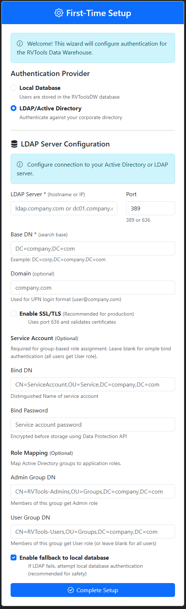
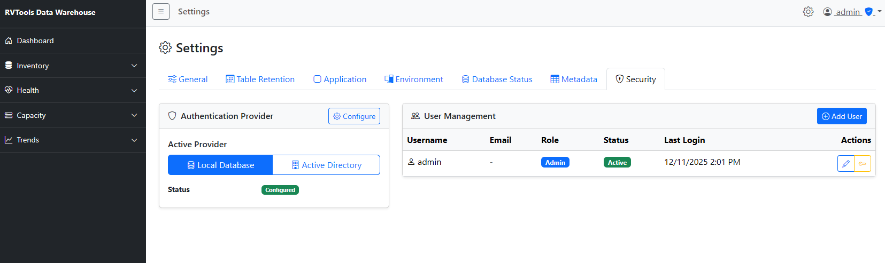
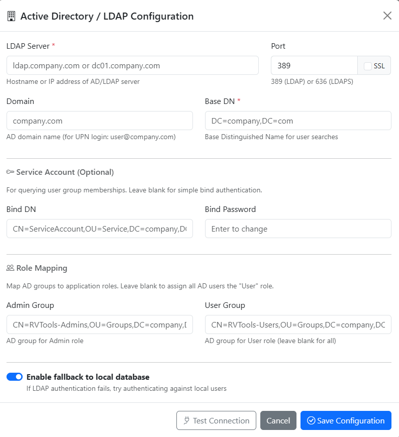

# LDAP/Active Directory Configuration Guide

**Navigation**: [Home](../README.md) | [Installation](installation.md) | [Authentication Setup](authentication-setup.md) | [Admin Settings](admin-settings-guide.md)

---

## Overview

This guide explains how to configure LDAP/Active Directory authentication for the RVTools Data Warehouse web application. LDAP authentication allows users to log in with their corporate credentials and assigns roles based on AD group membership.

### Benefits of LDAP Authentication

- **Centralized user management** - Users managed in Active Directory
- **Single sign-on experience** - Users use existing domain credentials
- **Automatic role assignment** - Based on AD security group membership
- **Enhanced security** - Leverage enterprise password policies and MFA
- **Simplified administration** - No need to manually create users in the application

---

## Configuration Methods

You can configure LDAP in two ways:

### Method 1: During First-Time Setup (Recommended)

When you first deploy the application, the setup wizard allows you to configure LDAP immediately:

1. Navigate to the application (automatically redirects to `/Account/Setup`)
2. Select **LDAP/Active Directory** from authentication provider options
3. Fill in LDAP connection details (server, port, Base DN)
4. Optionally configure service account and group mappings
5. Click **Complete Setup**
6. Log in with your AD credentials



See [Authentication Setup Guide](authentication-setup.md#after-setup-ldapactive-directory) for the complete first-time setup process.

### Method 2: After Setup via Settings

If you initially set up with LocalDB or need to modify LDAP settings:

1. Log in as Admin
2. Navigate to **Settings > Security**
3. Click **Configure** next to Authentication Provider
4. Configure or update LDAP settings

The rest of this guide focuses on Method 2 and provides detailed field explanations.

---

## Prerequisites

Before configuring LDAP, ensure you have:

1. **Active Directory or LDAP Server**
   - Hostname or IP address
   - Network connectivity from web server (ports 389/636)

2. **Service Account** (recommended for group queries)
   - Read-only AD account
   - Distinguished Name (DN) for the account
   - Password for the account

3. **Security Groups** (for role mapping)
   - AD group for Admin role users (e.g., `RVTools-Admins`)
   - AD group for User role users (e.g., `RVTools-Users`)
   - Distinguished Names (DNs) for both groups

4. **SSL Certificate** (for production)
   - Valid SSL certificate on LDAP server (port 636)
   - OR thumbprint of self-signed certificate for pinning

5. **Admin Access**
   - Logged in as Admin user to access Settings

---

## Configuration Steps

### 1. Access LDAP Configuration

1. Log in to the web application as an Admin user
2. Click the **gear icon** in the top-right corner
3. Navigate to the **Security** tab
4. Click the **Configure** button next to "Authentication Provider"



You'll see the LDAP configuration modal:



### 2. Configure LDAP Server

#### LDAP Server

Enter the hostname or IP address of your LDAP/AD server:

**Examples:**
- `ldap.company.com`
- `dc01.company.com`
- `192.168.1.10`

**Port**:
- `389` - Standard LDAP (not encrypted)
- `636` - LDAPS (SSL/TLS encrypted) **← Recommended for production**

**SSL Checkbox**:
- ☑ Enable SSL/TLS for production environments
- ☐ Disable only for testing/development

#### Domain

Enter your Active Directory domain name (optional but recommended for AD):

**Examples:**
- `company.com`
- `corp.company.com`

**Purpose**: Used for UPN login format (`user@company.com`)

#### Base DN

The LDAP search base for user and group lookups:

**Format**: `DC=domain,DC=tld`

**Examples:**
- `DC=company,DC=com`
- `DC=corp,DC=company,DC=com`
- `OU=Employees,DC=company,DC=com` (if users are in specific OU)

**How to find your Base DN**:

```powershell
# On Windows AD domain controller or workstation
(Get-ADDomain).DistinguishedName

# Result example: DC=company,DC=com
```

---

### 3. Configure Service Account (Optional)

The service account is used to query user group memberships after authentication.

**When to use**:
- ✅ Required if you want role-based access (Admin vs User)
- ✅ Required for group mapping
- ⛔ Skip for simple bind authentication (all users get User role)

#### Bind DN

The Distinguished Name of the service account:

**Format**: `CN=username,OU=path,DC=domain,DC=com`

**Example**:
```
CN=ServiceAccount,OU=Service,DC=company,DC=com
```

**How to find DN**:

```powershell
# Find user DN in Active Directory
Get-ADUser -Identity ServiceAccount | Select-Object DistinguishedName

# Result: CN=ServiceAccount,OU=Service,DC=company,DC=com
```

#### Bind Password

Enter the password for the service account.

**Security**: The password is encrypted using ASP.NET Core Data Protection API before being stored in the database. It is never stored in plaintext.

---

### 4. Configure Role Mapping

Map Active Directory security groups to application roles.


#### Admin Group

The DN of the AD group whose members should have Admin role:

**Format**: `CN=groupname,OU=path,DC=domain,DC=com`

**Example**:
```
CN=RVTools-Admins,OU=Groups,DC=company,DC=com
```

**How to find group DN**:

```powershell
# Find group DN in Active Directory
Get-ADGroup -Identity "RVTools-Admins" | Select-Object DistinguishedName

# Result: CN=RVTools-Admins,OU=Groups,DC=company,DC=com
```

#### User Group

The DN of the AD group whose members should have User role (read-only):

**Example**:
```
CN=RVTools-Users,OU=Groups,DC=company,DC=com
```

**Default behavior**: If a user is not a member of either group, they are assigned the User role by default.

#### Enable Fallback to Local Database

☑ **Enabled** (recommended): If LDAP authentication fails (server unavailable), the application will attempt to authenticate against local database users.

☐ **Disabled**: Only LDAP authentication is allowed. If LDAP fails, users cannot log in.

---

### 5. Test and Save Configuration

1. Click **Test Connection** to verify LDAP connectivity
2. Review all settings
3. Click **Save Configuration**

The authentication provider will be updated immediately.

---

## SSL/TLS Configuration

### Certificate Validation (Recommended)

By default, the application validates LDAP SSL certificates to prevent man-in-the-middle attacks.

**For production with trusted CA certificates**:
- ☑ Enable SSL (port 636)
- ☑ Validate Certificate checkbox is enabled by default
- No additional configuration needed

**For self-signed certificates**:
- ☑ Enable SSL (port 636)
- ☑ Validate Certificate
- Enter certificate thumbprint in **Certificate Thumbprint** field

### Finding Certificate Thumbprint

On Windows:

```powershell
# Export certificate from LDAP server
$cert = Get-ChildItem -Path Cert:\LocalMachine\My | Where-Object {$_.Subject -like "*ldap*"}
$cert.Thumbprint

# Result: A1B2C3D4E5F6G7H8I9J0K1L2M3N4O5P6Q7R8S9T0
```

On Linux:

```bash
# Get certificate from LDAP server
echo | openssl s_client -connect ldap.company.com:636 2>/dev/null | openssl x509 -fingerprint -noout -sha1

# Result: SHA1 Fingerprint=A1:B2:C3:D4:E5:F6:G7:H8:I9:J0:K1:L2:M3:N4:O5:P6:Q7:R8:S9:T0
```

**Enter thumbprint without colons or spaces**:
```
A1B2C3D4E5F6G7H8I9J0K1L2M3N4O5P6Q7R8S9T0
```

### Disabling Certificate Validation (Not Recommended)

⚠️ **Warning**: Only disable certificate validation for testing in isolated environments.

- ☐ Uncheck "Validate Certificate" checkbox
- The application will log warnings when validation is disabled

---

## How LDAP Authentication Works

### Login Flow

1. **User enters credentials** at `/Account/Login`
2. **Application attempts bind** to LDAP server with user's credentials
3. **If bind succeeds**, user is authenticated
4. **Application queries group membership** using service account
5. **Role assigned** based on group membership:
   - Member of Admin Group → Admin role
   - Member of User Group → User role
   - No group match → User role (default)
6. **User record created/updated** in `Web.Users` table (tracks last login, auth source)
7. **Session cookie issued** with user claims

### Fallback to LocalDB

If **"Enable fallback to local database"** is checked:

1. LDAP authentication attempted first
2. If LDAP fails (server unavailable, user not found, etc.), application attempts LocalDB authentication
3. User must exist in `Web.Users` table with valid password hash

**Use case**: Allows local admin accounts to work even if LDAP is down.

---

## Testing LDAP Configuration

### Test from PowerShell (Windows)

```powershell
# Test LDAP bind with user credentials
$ldapServer = "ldap.company.com"
$baseDN = "DC=company,DC=com"
$username = "testuser@company.com"
$password = "password"

$ldap = New-Object System.DirectoryServices.DirectoryEntry("LDAP://$ldapServer/$baseDN", $username, $password)

try {
    $null = $ldap.NativeObject
    Write-Host "LDAP bind successful" -ForegroundColor Green
} catch {
    Write-Host "LDAP bind failed: $_" -ForegroundColor Red
}
```

### Test from Linux

```bash
# Test LDAP bind
ldapsearch -x -H ldap://ldap.company.com:389 \
  -D "testuser@company.com" \
  -W \
  -b "DC=company,DC=com" \
  "(sAMAccountName=testuser)"

# For LDAPS (SSL)
ldapsearch -x -H ldaps://ldap.company.com:636 \
  -D "testuser@company.com" \
  -W \
  -b "DC=company,DC=com" \
  "(sAMAccountName=testuser)"
```

### Test Group Membership Query

```powershell
# Query user's groups (requires service account)
$serviceAccount = "CN=ServiceAccount,OU=Service,DC=company,DC=com"
$servicePassword = "password"

$ldap = New-Object System.DirectoryServices.DirectoryEntry(
    "LDAP://ldap.company.com/DC=company,DC=com",
    $serviceAccount,
    $servicePassword
)

$searcher = New-Object System.DirectoryServices.DirectorySearcher($ldap)
$searcher.Filter = "(sAMAccountName=testuser)"
$searcher.PropertiesToLoad.Add("memberOf") | Out-Null

$result = $searcher.FindOne()
$result.Properties["memberOf"]
```

---

## Troubleshooting

### LDAP Connection Failed

**Error**: "Cannot connect to LDAP server"

**Check**:
1. Verify server hostname/IP is correct
2. Verify port (389 vs 636)
3. Test network connectivity: `Test-NetConnection ldap.company.com -Port 636`
4. Check firewall rules allow outbound LDAP/LDAPS
5. Verify LDAP service is running on server

### Certificate Validation Failed

**Error**: "LDAP certificate validation failed"

**Solutions**:
1. **Add certificate to trusted store** (recommended):
   ```powershell
   # Export certificate from LDAP server
   # Import to Trusted Root Certification Authorities
   ```

2. **Use certificate thumbprint pinning**:
   - Get thumbprint from LDAP server certificate
   - Enter in "Certificate Thumbprint" field
   - Save configuration

3. **Disable validation** (testing only):
   - ☐ Uncheck "Validate Certificate"
   - Application will log security warnings

### User Cannot Log In with AD Credentials

**Check**:
1. Verify user can bind to LDAP directly (see testing section above)
2. Check Base DN includes the user's OU
3. Verify domain is correct (for UPN format)
4. Check user account is not locked in AD
5. Review application logs in `Web.ErrorLog` table:

```sql
SELECT TOP 10 * FROM Web.ErrorLog
WHERE ErrorMessage LIKE '%LDAP%'
ORDER BY ErrorDate DESC;
```

### Group Membership Not Detected

**Error**: User logs in but has wrong role

**Check**:
1. Verify service account (Bind DN) is configured
2. Verify service account can read group memberships
3. Check group DNs are correct (CN=, OU=, DC= format)
4. Test group query with PowerShell (see testing section)
5. Verify user is actually a member of the groups in AD:

```powershell
Get-ADPrincipalGroupMembership -Identity testuser | Select-Object Name
```

### Bind DN Authentication Failed

**Error**: "Service account bind failed"

**Check**:
1. Verify Bind DN format is correct (`CN=username,OU=path,DC=domain,DC=com`)
2. Verify service account password is correct
3. Check service account is not locked/expired in AD
4. Verify service account has read permissions in AD

### SSL/TLS Connection Issues

**For port 636 connections**:
1. Verify LDAP server has SSL certificate installed
2. Check certificate is not expired
3. Verify certificate hostname matches LDAP server name
4. Test with `openssl s_client -connect ldap.company.com:636`

---

## Security Considerations

### Credential Protection

- **LDAP bind passwords are encrypted** using ASP.NET Core Data Protection API
- Passwords are never stored in plaintext in the database
- Encrypted with application-specific keys
- For multi-server deployments, configure shared key storage (Azure Blob, Redis, etc.)

### Certificate Validation

- **Always validate certificates in production** to prevent MITM attacks
- Only disable validation for isolated testing environments
- Use certificate thumbprint pinning for self-signed certificates
- Application logs warnings when validation is disabled

### Service Account Permissions

The service account only needs:
- ✅ Read permission on Base DN
- ✅ Read group membership permissions
- ⛔ Does NOT need write permissions
- ⛔ Does NOT need admin privileges

**Least privilege**: Create a dedicated read-only service account for RVTools.

---

## Common Scenarios

### Scenario 1: Basic AD Integration (Recommended)

**Setup**:
- LDAP Server: `dc01.company.com`
- Port: `636` (SSL enabled)
- Domain: `company.com`
- Base DN: `DC=company,DC=com`
- Service Account: `CN=RVToolsSvc,OU=Service Accounts,DC=company,DC=com`
- Admin Group: `CN=RVTools-Admins,OU=Security Groups,DC=company,DC=com`
- User Group: (leave blank - all AD users get User role)
- Fallback: ☑ Enabled

**Result**:
- All domain users can log in with User role
- Members of RVTools-Admins get Admin role
- If LDAP fails, local admin account still works

### Scenario 2: Multiple LDAP Servers (Failover)

For high availability, use DNS round-robin or load balancer:

**LDAP Server**: `ldap.company.com` (resolves to multiple DCs)

Alternatively, configure multiple Base DNs if users are in different OUs:

**Base DN**: `DC=company,DC=com` (searches entire domain)

### Scenario 3: Self-Signed Certificate

**For dev/test with self-signed LDAP certificate**:

1. Get certificate thumbprint:
   ```bash
   echo | openssl s_client -connect ldap.company.com:636 2>/dev/null | openssl x509 -fingerprint -noout -sha1
   ```

2. Enter thumbprint in configuration (remove colons/spaces)
3. Enable SSL and certificate validation
4. Save configuration

### Scenario 4: No Service Account (Simple Bind)

**When to use**: Small environments where all users have same role

**Setup**:
- Leave Bind DN and Bind Password blank
- Leave Admin Group and User Group blank
- All authenticated users get User role by default

**Limitation**: Cannot differentiate between Admin and User roles based on groups.

---

## Advanced Configuration

### Multi-Forest Active Directory

For environments with multiple AD forests:

1. Configure Global Catalog server: `ldap.company.com:3268` (or 3269 for SSL)
2. Use forest root Base DN: `DC=company,DC=com`
3. Ensure service account has permissions in all forests

### LDAP (Non-AD) Servers

For generic LDAP (OpenLDAP, etc.):

**Adjust search filters** if needed (application uses `sAMAccountName` for AD, falls back to `uid` for LDAP):

- Base DN: `ou=people,dc=company,dc=com`
- User search: `(uid=username)`
- Group attribute: `memberOf` or `groupMembership`

### Performance Tuning

**Caching**: User group memberships are queried on each login. For large organizations:

1. Minimize Base DN scope (use specific OU instead of domain root)
2. Ensure AD indexes are optimized
3. Use LDAPS (encrypted) on port 636 for production

---

## Switching Authentication Providers

### From LocalDB to LDAP

1. Navigate to Settings > Security
2. Click Configure next to Authentication Provider
3. Click **Active Directory** button
4. Configure LDAP settings
5. Click Save Configuration

**Effect**: Immediately switches to LDAP authentication for new logins. Existing sessions remain valid until expiration.

### From LDAP to LocalDB

1. Navigate to Settings > Security
2. Click Configure
3. Click **Local Database** button
4. Click Save Configuration

**Effect**: Switches back to local database authentication. LDAP configuration is retained but not used.

---

## Monitoring and Logs

### Check Authentication Events

```sql
-- View recent authentication errors
SELECT TOP 20 *
FROM Web.ErrorLog
WHERE ErrorMessage LIKE '%LDAP%' OR ErrorMessage LIKE '%auth%'
ORDER BY ErrorDate DESC;

-- View user login activity
SELECT Username, LastLoginDate, AuthSource, IsActive
FROM Web.Users
WHERE AuthSource = 'LDAP'
ORDER BY LastLoginDate DESC;
```

### Application Logs

The application logs LDAP events with these log levels:

- **Information**: Successful LDAP authentication
- **Warning**: LDAP fallback to LocalDB, certificate validation disabled
- **Error**: LDAP connection failures, bind failures, certificate validation errors

---

## Appendix: LDAP Field Reference

| Field | Required | Format | Example | Purpose |
|-------|----------|--------|---------|---------|
| LDAP Server | Yes | Hostname or IP | `ldap.company.com` | LDAP/AD server address |
| Port | Yes | Integer | `636` | LDAP port (389 or 636) |
| Domain | No | Domain name | `company.com` | AD domain for UPN login |
| Base DN | Yes | DN format | `DC=company,DC=com` | LDAP search base |
| SSL | No | Checkbox | Checked | Enable SSL/TLS encryption |
| Validate Certificate | No | Checkbox | Checked | Validate SSL certificates |
| Certificate Thumbprint | No | Hex string | `A1B2C3D4...` | Pin self-signed cert |
| Bind DN | No | DN format | `CN=svc,OU=Service,DC=company,DC=com` | Service account DN |
| Bind Password | No | String | `password` | Service account password (encrypted) |
| Admin Group | No | DN format | `CN=Admins,OU=Groups,DC=company,DC=com` | AD group for Admin role |
| User Group | No | DN format | `CN=Users,OU=Groups,DC=company,DC=com` | AD group for User role |
| Fallback to Local DB | No | Checkbox | Checked | Allow LocalDB if LDAP fails |

---

## Next Steps

- [Authentication Setup Guide](authentication-setup.md) - General authentication concepts
- [Admin Settings Guide](admin-settings-guide.md) - Managing all Settings tabs
- [Security Hardening Guide](security-hardening.md) - Security best practices
- [Troubleshooting Guide](reference/troubleshooting.md) - General troubleshooting
