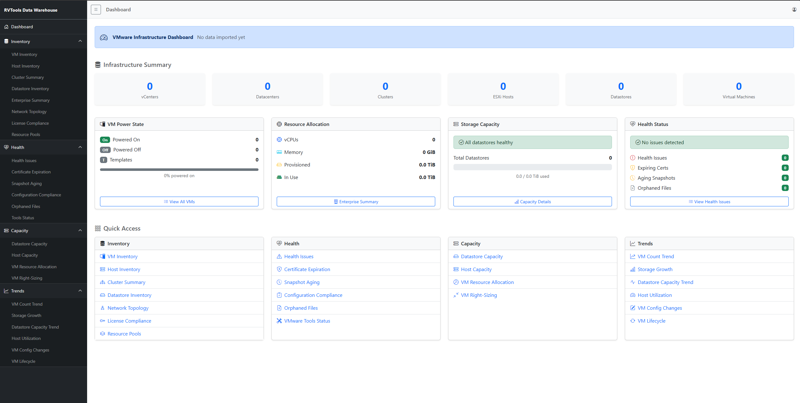

# Web Reports Application

**Navigation**: [Getting Started](./getting-started.md) | [Architecture Overview](./architecture/overview.md) | [Reports Guide](./usage/reports.md)

---

A modern, browser-based reporting interface for the RVTools Data Warehouse that provides real-time access to your VMware infrastructure data through interactive dashboards and reports.



## Overview

The Web Reports application is an ASP.NET Core 8.0 MVC application that connects directly to the RVToolsDW database and presents the same 24 reports available through SSRS in a modern, responsive web interface. The application features a unified dashboard with infrastructure summary metrics, health status indicators, and quick navigation to all reports.

### Authentication Required

**All web reports require authentication.** On first deployment, you'll be guided through a setup wizard to configure authentication. See [Authentication Setup Guide](authentication-setup.md) for details.

**Access Levels:**
- **Admin role**: Full access to reports + Settings/Security administration
- **User role**: Read-only access to all reports

## Features

### Dashboard
- **Infrastructure Summary** - At-a-glance counts for vCenters, Datacenters, Clusters, ESXi Hosts, Datastores, and Virtual Machines
- **VM Power State** - Breakdown of powered on, powered off, and template VMs with visual progress indicator
- **Resource Allocation** - Total vCPUs, memory, provisioned storage, and in-use storage across all VMs
- **Storage Capacity** - Datastore health status with capacity utilization and warning/critical thresholds
- **Health Status** - Aggregated health issues, expiring certificates, aging snapshots, and orphaned files

### Reports by Category

**Inventory (7 reports)**
- VM Inventory
- Host Inventory
- Cluster Summary
- Datastore Inventory
- Network Topology
- License Compliance
- Resource Pools

**Health (6 reports)**
- Health Issues
- Certificate Expiration
- Snapshot Aging
- Configuration Compliance
- Orphaned Files
- VMware Tools Status

**Capacity (4 reports)**
- Datastore Capacity
- Host Capacity
- VM Resource Allocation
- VM Right-Sizing

**Trends (6 reports)**
- VM Count Trend
- Storage Growth
- Datastore Capacity Trend
- Host Utilization
- VM Config Changes
- VM Lifecycle

### Interactive Features
- **Sortable & Searchable Tables** - DataTables integration for all tabular reports
- **Interactive Charts** - Chart.js visualizations for trend data and capacity metrics
- **Responsive Design** - Bootstrap 5 layout adapts to desktop, tablet, and mobile screens
- **Dark Sidebar Navigation** - Collapsible sidebar with organized report categories
- **Export Capabilities** - Excel export functionality for report data

## Technology Stack

| Component | Technology |
|-----------|------------|
| Framework | ASP.NET Core 8.0 MVC |
| ORM | Dapper (micro-ORM) |
| Database | SQL Server 2016+ (RVToolsDW) |
| CSS Framework | Bootstrap 5 |
| Icons | Bootstrap Icons |
| Charts | Chart.js |
| Data Tables | DataTables |
| Client Library Manager | LibMan |

## Project Structure

```
src/web/
├── RVToolsWeb.sln
└── RVToolsWeb/
    ├── Configuration/       # App settings models
    ├── Controllers/         # MVC controllers by category
    │   ├── Api/            # REST API endpoints
    │   ├── Capacity/       # Capacity report controllers
    │   ├── Health/         # Health report controllers
    │   ├── Inventory/      # Inventory report controllers
    │   └── Trends/         # Trend report controllers
    ├── Data/               # Data access layer
    │   └── Repositories/   # Dapper repository implementations
    ├── Models/             # Data models and view models
    │   ├── DTOs/          # Data transfer objects
    │   └── ViewModels/    # View-specific models
    ├── Services/           # Business logic services
    ├── Views/              # Razor views by controller
    └── wwwroot/            # Static assets (CSS, JS, libs)
```

## Getting Started

### Prerequisites
- .NET 8.0 SDK
- SQL Server 2016+ with RVToolsDW database deployed
- RVTools data imported via PowerShell ETL pipeline

### Configuration

Update `appsettings.json` with your database connection:

```json
{
  "ConnectionStrings": {
    "RVToolsDW": "Server=localhost;Database=RVToolsDW;Trusted_Connection=True;TrustServerCertificate=True;"
  }
}
```

### Running the Application

```bash
cd src/web/RVToolsWeb
dotnet restore
dotnet run
```

The application will start on `https://localhost:5001` (or the port configured in `launchSettings.json`).

### Deployment to IIS

#### Prerequisites
- Windows Server with IIS installed
- [ASP.NET Core 8.0 Hosting Bundle](https://dotnet.microsoft.com/download/dotnet/8.0)

#### Publish the Application

```bash
cd src/web/RVToolsWeb
dotnet publish -c Release -o ./publish
```

#### Configure IIS

1. Open IIS Manager
2. Create a new Application Pool:
   - Name: `RVToolsWeb`
   - .NET CLR Version: `No Managed Code`
   - Managed Pipeline Mode: `Integrated`
3. Create a new Website or Application:
   - Physical Path: Point to the `publish` folder
   - Application Pool: `RVToolsWeb`
   - Binding: Configure HTTP/HTTPS as needed

#### Production Connection String

Update `appsettings.json` in the publish folder with your production connection string:

```json
{
  "ConnectionStrings": {
    "RVToolsDW": "Server=SQLSERVER;Database=RVToolsDW;Trusted_Connection=True;TrustServerCertificate=True;"
  }
}
```

For SQL Authentication:
```json
{
  "ConnectionStrings": {
    "RVToolsDW": "Server=SQLSERVER;Database=RVToolsDW;User Id=username;Password=password;TrustServerCertificate=True;"
  }
}
```

## Administration

The web application includes an admin Settings section for managing the system. See [Admin Settings Guide](admin-settings-guide.md) for documentation on:

- **General Settings** - Database configuration (retention days, log levels, notifications)
- **Table Retention** - Per-table history retention overrides
- **Application Settings** - UI theme, caching, logging configuration
- **Environment** - View/switch ASP.NET environment (Development/Production)
- **Database Status** - Connection health, table statistics, import history
- **Metadata** - View table/column mappings and natural keys
- **Security** - User management and authentication provider configuration

**Access**: Admin role required. Click the gear icon in the top-right corner.

## Related Documentation

- [Authentication Setup Guide](authentication-setup.md) - First-time setup and login
- [LDAP Configuration Guide](ldap-configuration.md) - Configuring Active Directory authentication
- [Admin Settings Guide](admin-settings-guide.md) - Managing all Settings tabs
- [SSRS Reports User Guide](./SSRS_Reports_User_Guide.md) - Original SSRS report documentation
- [Database Schema](./architecture/database-schema.md) - Understanding the data model
- [Data Flow](./architecture/data-flow.md) - How data moves from RVTools to reports
