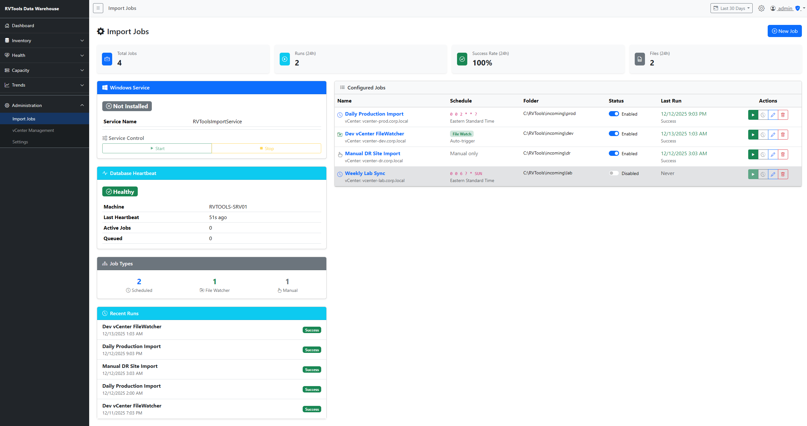
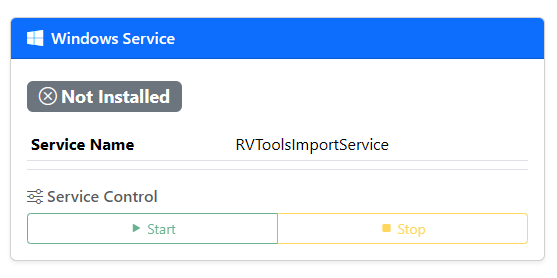
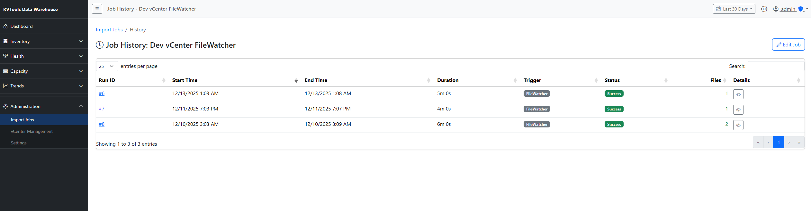
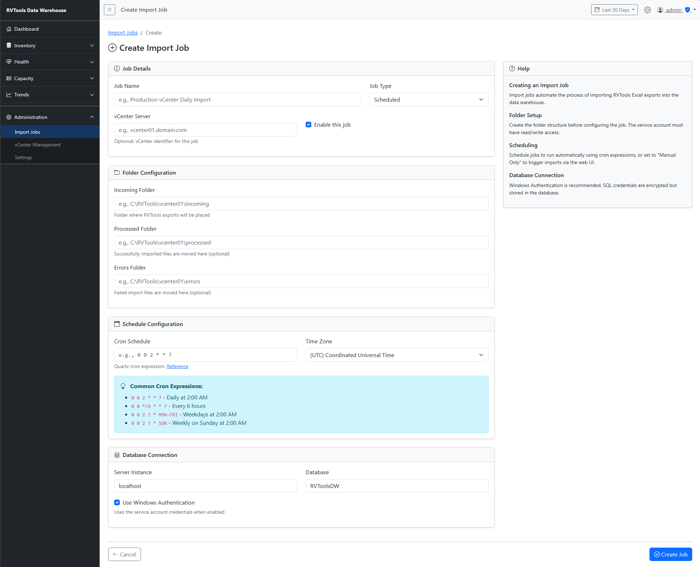
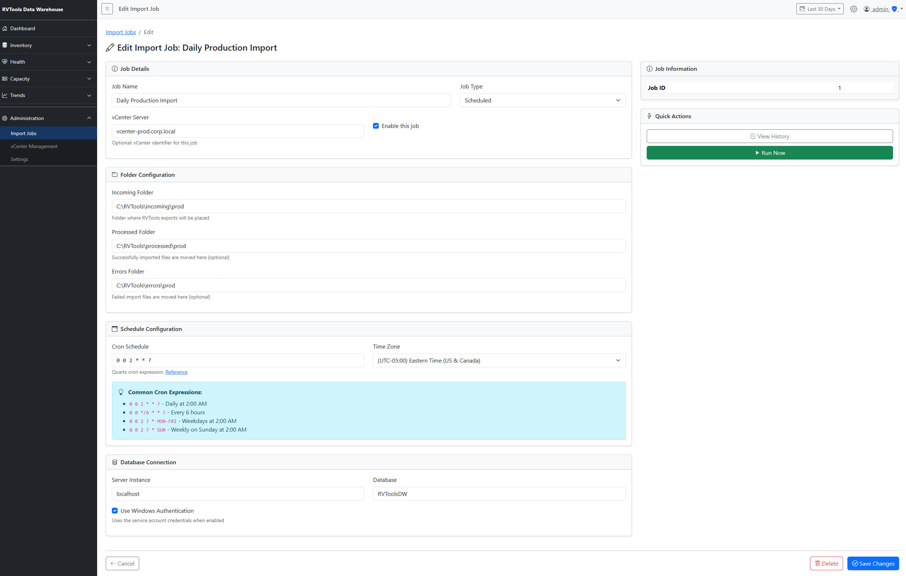

# RVTools Import Windows Service

## Overview

The RVTools Import Service is a Windows Service that automates the import of RVTools Excel exports into the SQL Server data warehouse. It supports three trigger modes:

- **Scheduled**: Cron-based scheduling via Quartz.NET
- **FileWatcher**: Automatic detection of new files in watched folders
- **Manual**: On-demand triggers from the web UI

## Architecture

```
┌──────────────────┐     ┌──────────────────┐     ┌──────────────────┐
│   RVToolsWeb     │     │  RVToolsService  │     │   SQL Server     │
│  (ASP.NET Core)  │────▶│  (Windows Svc)   │────▶│   (RVToolsDW)    │
│                  │     │                  │     │                  │
│  Job Management  │     │  - Scheduler     │     │  Service.Jobs    │
│  UI Controls     │     │  - File Watcher  │     │  Service.JobRuns │
│                  │     │  - Import Logic  │     │  Audit.Import*   │
└──────────────────┘     └──────────────────┘     └──────────────────┘
```

The web application and service communicate through database tables:
- `Service.Jobs` - Job configuration
- `Service.JobTriggers` - Manual trigger queue
- `Service.JobRuns` - Execution history
- `Service.ServiceStatus` - Health monitoring

## Installation

### 1. Prerequisites

- Windows Server 2019+ or Windows 10+
- .NET 8.0 Runtime
- SQL Server 2016+ with RVToolsDW database
- Service account with appropriate permissions

### 2. Deploy the Service

```powershell
# Build and publish
cd src/service/RVToolsService
dotnet publish -c Release -o C:\Services\RVToolsService

# Create Windows Service
sc.exe create "RVToolsImportService" `
    binPath= "C:\Services\RVToolsService\RVToolsService.exe" `
    DisplayName= "RVTools Import Service" `
    start= auto `
    obj= ".\LocalSystem"

# Start the service
sc.exe start "RVToolsImportService"

# Verify
Get-Service "RVToolsImportService"
```

### 3. Deploy Database Schema

Execute in order:
```sql
-- 1. Create Service schema
src/tsql/Database/006_CreateServiceSchema.sql

-- 2. Create Service tables
src/tsql/Tables/Service/001_Jobs.sql
src/tsql/Tables/Service/002_JobRuns.sql
src/tsql/Tables/Service/003_JobTriggers.sql
src/tsql/Tables/Service/004_ServiceStatus.sql

-- 3. Link to Audit schema
src/tsql/Tables/Audit/006_AddJobRunIdColumn.sql
```

## Configuration

### appsettings.json

```json
{
  "ConnectionStrings": {
    "RVToolsDW": "Server=localhost;Database=RVToolsDW;Trusted_Connection=True;TrustServerCertificate=True"
  },
  "ServiceSettings": {
    "ServiceName": "RVToolsImportService",
    "HeartbeatIntervalSeconds": 30,
    "ManualTriggerPollSeconds": 10
  },
  "FileMonitor": {
    "DebounceDelaySeconds": 5,
    "FileStabilityDelaySeconds": 2
  },
  "DataProtection": {
    "ApplicationName": "RVTools",
    "KeyStorePath": "C:\\ProgramData\\RVTools\\keys"
  },
  "Quartz": {
    "quartz.scheduler.instanceName": "RVToolsScheduler",
    "quartz.scheduler.instanceId": "AUTO",
    "quartz.threadPool.threadCount": "5",
    "quartz.jobStore.type": "Quartz.Simpl.RAMJobStore, Quartz"
  }
}
```

### Configuration Options

| Setting | Default | Description |
|---------|---------|-------------|
| `ServiceSettings:HeartbeatIntervalSeconds` | 30 | How often the service updates its health status |
| `ServiceSettings:ManualTriggerPollSeconds` | 10 | How often to check for manual trigger requests |
| `FileMonitor:DebounceDelaySeconds` | 5 | Wait time before processing a newly detected file |
| `FileMonitor:FileStabilityDelaySeconds` | 2 | Additional wait if file appears to still be copying |

## Job Types

### Scheduled Jobs

Run on a cron schedule using Quartz.NET.

**Cron Expression Examples:**
- `0 0 2 * * ?` - Daily at 2:00 AM
- `0 0 */6 * * ?` - Every 6 hours
- `0 30 8 ? * MON-FRI` - Weekdays at 8:30 AM

**Configuration:**
- Set `JobType = 'Scheduled'`
- Provide a valid cron expression in `CronSchedule`
- Specify timezone (default: UTC)

### FileWatcher Jobs

Automatically trigger imports when new `.xlsx` files appear in the incoming folder.

**How it works:**
1. FileSystemWatcher monitors the incoming folder
2. When a new file is detected, it waits for the debounce period
3. Service checks if the file is fully written (not locked)
4. Import triggers automatically

**Configuration:**
- Set `JobType = 'FileWatcher'`
- `CronSchedule` is ignored for this type
- Files matching `*.xlsx` are processed

**Debouncing:**
- Files may be large and take time to copy
- Service waits 5 seconds (configurable) before processing
- Checks file lock to ensure copy is complete

### Manual Jobs

Triggered on-demand from the web UI.

**Configuration:**
- Set `JobType = 'Manual'`
- No schedule required
- Use "Run Now" button in web UI

## Web UI Job Management

Navigate to **Administration > Import Jobs** in the web application.



### Features

1. **Dashboard**
   - Service health status (Running/Stopped)
   - Last heartbeat time
   - 24-hour statistics (runs, success rate, files processed)
   - Job type breakdown



2. **Job List**
   - Create, edit, delete jobs
   - Enable/disable jobs
   - View incoming folder path
   - See last run status

3. **Run Now**
   - Trigger immediate execution
   - Works for all job types

4. **History**
   - View execution history per job
   - Status, duration, files processed
   - Error details if failed



### Creating a Job



### Editing a Job



## Service Account Permissions

### SQL Server

```sql
-- Create login (Windows Authentication)
CREATE LOGIN [DOMAIN\svc-rvtools] FROM WINDOWS;

-- Grant database access
USE RVToolsDW;
CREATE USER [svc-rvtools] FOR LOGIN [DOMAIN\svc-rvtools];
EXEC sp_addrolemember 'db_datareader', 'svc-rvtools';
EXEC sp_addrolemember 'db_datawriter', 'svc-rvtools';
GRANT EXECUTE ON SCHEMA::dbo TO [svc-rvtools];
```

### File System

| Path | Permission | Purpose |
|------|------------|---------|
| `C:\RVTools\incoming\` | Read, Write | Source files |
| `C:\RVTools\processed\` | Read, Write | Successfully imported files |
| `C:\RVTools\errors\` | Read, Write | Failed files |
| `C:\ProgramData\RVTools\keys\` | Read, Write | Data Protection keys |

## Troubleshooting

### Service Won't Start

1. Check Event Viewer: Application Log
2. Run as console to see errors:
   ```powershell
   C:\Services\RVToolsService\RVToolsService.exe
   ```
3. Verify SQL Server connectivity
4. Check service account permissions

### Jobs Not Running

1. Check service status in web UI
2. Verify job is enabled
3. Check `Service.ServiceStatus.LastHeartbeat` is recent
4. Review `Service.JobRuns` for error messages

### FileWatcher Not Detecting Files

1. Verify folder path exists
2. Check service account has read access
3. Ensure files have `.xlsx` extension
4. Wait for debounce period (5 seconds default)

### Manual Trigger Not Working

1. Check `Service.JobTriggers` for pending triggers
2. Verify service heartbeat is updating
3. Ensure job is enabled

### View Logs

```sql
-- Recent job runs
SELECT TOP 20 *
FROM [Service].[JobRuns]
ORDER BY StartTime DESC;

-- Service health
SELECT * FROM [Service].[ServiceStatus];

-- Pending triggers
SELECT *
FROM [Service].[JobTriggers]
WHERE ProcessedDate IS NULL;
```

## Monitoring

### Health Check Query

```sql
-- Check if service is healthy (heartbeat within 2 minutes)
SELECT
    CASE
        WHEN DATEDIFF(MINUTE, LastHeartbeat, GETUTCDATE()) < 2 THEN 'Healthy'
        WHEN DATEDIFF(MINUTE, LastHeartbeat, GETUTCDATE()) < 10 THEN 'Warning'
        ELSE 'Critical'
    END AS HealthStatus,
    LastHeartbeat,
    DATEDIFF(MINUTE, LastHeartbeat, GETUTCDATE()) AS MinutesSinceHeartbeat
FROM [Service].[ServiceStatus]
WHERE ServiceName = 'RVToolsImportService';
```

### 24-Hour Statistics

```sql
SELECT
    COUNT(*) AS TotalRuns,
    SUM(CASE WHEN Status = 'Success' THEN 1 ELSE 0 END) AS Successful,
    SUM(CASE WHEN Status = 'Failed' THEN 1 ELSE 0 END) AS Failed,
    SUM(FilesProcessed) AS TotalFiles,
    AVG(DurationMs) AS AvgDurationMs
FROM [Service].[JobRuns]
WHERE StartTime >= DATEADD(HOUR, -24, GETUTCDATE());
```

## Coexistence with PowerShell

The Windows Service and PowerShell scripts can coexist:

- Both use the same database and stored procedures
- PowerShell remains available as a fallback
- Service handles automated imports
- PowerShell useful for ad-hoc or historical imports

To disable service and use PowerShell:
```powershell
sc.exe stop "RVToolsImportService"
cd C:\RVTools\src\powershell
.\Import-RVToolsData.ps1 -ServerInstance localhost
```
